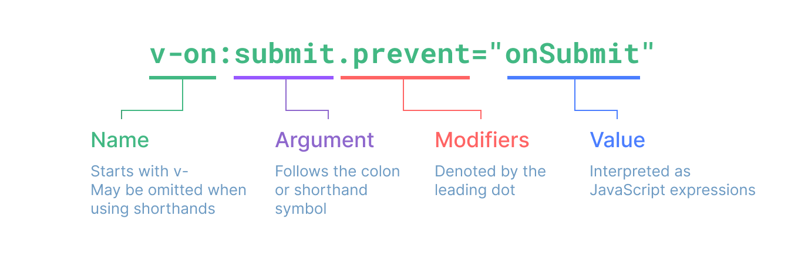

# VUE BASIC

### Reactive State

- **`ref()`**: Creates a reactive reference to a value that can be mutated. Directly mutates the value using `.value`.
- **`reactive`**: Creates a reactive object where changes to its properties are tracked.
- **[Vue 3 Reactivity API - `ref()`](https://vuejs.org/api/reactivity-core.html#ref)**

### [Computed Properties](components/Computed.vue)

- Computed properties automatically update when their reactive dependencies change, ensuring efficient reactivity and computed value caching.

### Built-in Directives

- **`v-if`**: Conditional rendering based on a truthy value.
- **`v-for`**: Iterates over a list of items to render multiple elements.
- **`v-model`**: Creates two-way data bindings on form inputs.
- **`v-bind`**: bind an attribute to an expression shorthand :something="" .

- **[Vue 3 Built-in Directives](https://vuejs.org/api/built-in-directives.html#v-for)**

### [defineProps](components/DefineProps.vue)

- `defineProps` is used in Vue 3's `<script setup>` to declare props in a functional style, enhancing readability and maintainability.

### Watchers

- Watchers observe changes to a specific reactive property and execute a callback when the property changes.

- **[Vue Watchers Guide](https://vuejs.org/guide/essentials/watchers.html#watchers)**

### [Emit](components/Emit.vue)

- `$emit` allows child components in Vue.js to trigger custom events that parent components or ancestors can listen to using `v-on` or `@`.

### [Composable.vue](components/Composables/useItem.ts)

- Composables encapsulate reusable reactive logic in Vue.js, promoting modular and efficient state management within components.

### [Lifecycle Hooks](components/LifeCycleHooks.vue)

- Lifecycle hooks in Vue.js allow efficient management of component initialization, state updates, DOM manipulation, and cleanup.

### info

- Use `{{ variable }}` for data binding in templates.
- Capitalize component names (`<MyComponent />`).
- Use `:prop="variable"` for one-way data binding in Vue.js.
- Use `@` for DOM Events eks @click, @click.ctrl, @keydown 

    

